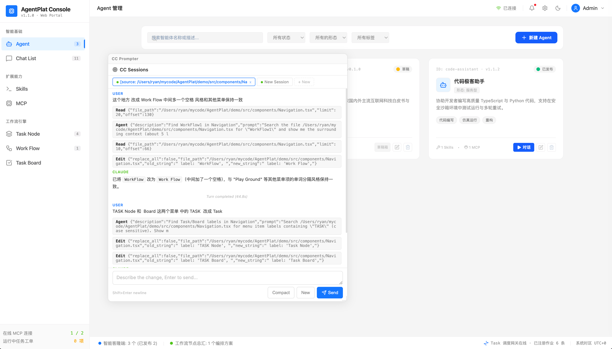

# CC Prompter

**Shift+Alt 点击页面元素 → Claude Code 直接改代码 → 页面自动刷新**

一个 Vite 插件，将 [Claude Code CLI](https://docs.anthropic.com/en/docs/claude-code) 接入你的前端开发工作流。通过可视化元素定位 + 常驻 PTY 会话，实现「点击 → 描述 → 代码自动修改 → HMR 刷新」的闭环。



## 快速开始

### 安装

```bash
npm install cc-prompter
```

> 前提：本地需要已安装 [Claude Code CLI](https://docs.anthropic.com/en/docs/claude-code)（终端执行 `claude` 命令可用）。插件仅在 dev 模式生效，`npm run build` 不会注入任何代码。

### 配置

在 `vite.config.ts` 中添加插件（一行配置即可）：

```typescript
import { ccPromptPlugin } from 'cc-prompter';
import react from '@vitejs/plugin-react';
import { defineConfig } from 'vite';

export default defineConfig({
  plugins: [
    ccPromptPlugin(),  // ← 这一行就够了
    react(),
  ],
});
```

> `ccPromptPlugin()` 内部自动完成三件事：
> 1. 集成 `code-inspector-plugin`（编译时给 DOM 打上源码路径标签）
> 2. 启动 Express sidecar 服务（管理 Claude PTY 会话）
> 3. 注入交互脚本（监听 Shift+Alt 点击，弹出面板）

### 一键安装（给 Claude Code 用）

复制下面这行，粘贴给 Claude Code，它会自动帮你完成安装和配置：

```
帮我安装 cc-prompter 并在 vite.config.ts 中添加 ccPromptPlugin() 插件配置，这是一个 Vite 插件，用于集成 Claude Code CLI 和 code-inspector 元素定位功能
```

## 怎么用

### 启动

```bash
npm run dev
```

启动后，浏览器打开你的开发页面，CC Prompter 已经在后台就绪了。

### 触发面板

| 操作 | 说明 |
|------|------|
| **Shift + Alt + 鼠标悬停** | 进入元素定位模式。鼠标移到哪个元素上，哪个元素会高亮标记，顶部浮出源码路径（如 `src/components/Button.tsx:12:5`） |
| **Shift + Alt + 点击元素** | 弹出 CC Prompter 面板（浮动 iframe），自动将点击元素的文件路径、行列号附加到当前 session 的上下文中 |

> 面板弹出后，你可以直接在输入框描述想要的修改，比如「把按钮改成圆角蓝色」。Claude 会直接修改代码文件，Vite HMR 自动热更新页面。

### 面板控制

| 操作 | 说明 |
|------|------|
| **Escape** | 隐藏面板（面板不会销毁，会话保持） |
| **Ctrl + Shift + P** | 重新显示面板 / 召回面板。随时用这个快捷键把隐藏的面板调出来 |
| **拖拽面板顶栏** | 自由移动面板位置 |
| **拖拽面板边缘/四角** | 调整面板大小 |

### 多 Session

面板顶部有 Tab 栏，支持多会话并行：

- 点击 **「+」** 创建新 Session
- 每个 Session 拥有独立的 Claude 进程、源码定位、对话上下文
- 在 Session 1 执行修改的同时，可以在 Session 2 发起另一个请求
- 切换 Tab 互不干扰，SSE 事件只渲染到对应 Session

### 中断生成

Claude 正在生成时，点击输入框旁边的 **Stop** 按钮，发送 Escape 中断。会话不会销毁，可以继续对话。

## 功能特性

- 🎯 **元素定位** — 内置 code-inspector-plugin，Shift+Alt 悬停即显示源码路径
- 💬 **多 Session** — 多个独立 Claude 会话并行，Tab 切换互不干扰
- ⚡ **流式渲染** — Markdown 实时渲染，工具调用按序展示，进度指示
- ⏹ **随时中断** — Stop 按钮打断 Claude 生成，会话不销毁
- 🖼 **灵活面板** — 浮动 iframe，拖拽移动、边缘缩放、快捷键召回
- 🔌 **零配置** — 一行 `ccPromptPlugin()` 搞定所有集成
- 🏭 **零侵入** — 仅 dev 模式生效，生产构建不注入任何代码

## 构建工具兼容性

底层使用 [code-inspector-plugin](https://github.com/zh-lx/code-inspector)，已支持主流前端构建工具：

| 构建工具 | CC Prompter 状态 | 说明 |
|----------|-----------------|------|
| **Vite** | ✅ 完整支持 | 默认配置 |
| Webpack | 🔜 计划中 | code-inspector 已支持，需适配 sidecar 启动逻辑 |
| esbuild | 🔜 计划中 | code-inspector 已支持 |
| Turbopack | 🔜 计划中 | code-inspector 已支持 |
| Mako | 🔜 计划中 | code-inspector 已支持 |

> `code-inspector-plugin` 本身已支持上述五种构建工具。CC Prompter 的 sidecar 和脚本注入部分与构建工具无关，只需适配各工具的插件注册方式即可扩展。

## 配置选项

```typescript
interface CcPromptOptions {
  /** Sidecar 端口，默认 3456（被占用时自动 +1） */
  port?: number;
  /** 项目根目录，默认 vite config.root */
  root?: string;
  /** 是否启用 code-inspector，默认 true */
  inspector?: boolean;
}
```

### 示例

```typescript
// 自定义端口
ccPromptPlugin({ port: 4000 })

// 禁用内置 code-inspector（你自己配置）
ccPromptPlugin({ inspector: false })
```

## 架构

```text
┌─────────────────────────────────────────────────┐
│                  Vite Dev Server                 │
│                                                  │
│  ┌──────────┐   ┌───────────┐   ┌────────────┐  │
│  │  React    │   │  inject.js│   │  panel.html│  │
│  │  App      │◄──│  (events) │──►│  (iframe)  │  │
│  └──────────┘   └─────┬─────┘   └─────┬──────┘  │
│                       │ postMessage       │ SSE   │
└───────────────────────┼──────────────────┼────────┘
                        │                  │
                   ┌────▼──────────────────▼────┐
                   │     Sidecar (Express)       │
                   │     localhost:3456          │
                   │                             │
                   │  ┌───────┐  ┌───────┐      │
                   │  │ PTY 1 │  │ PTY 2 │ ...  │
                   │  │ Claude│  │ Claude│      │
                   │  └───────┘  └───────┘      │
                   └─────────────────────────────┘
```

| 组件 | 技术 | 说明 |
|------|------|------|
| vite-plugin | TypeScript | 组合 code-inspector + sidecar 启动 + 脚本注入 |
| sidecar | Express | 管理 PTY session 生命周期，REST API + SSE 流 |
| pty-session | node-pty | 管理 Claude CLI 进程，PTY 输出 + JSONL 双通道解析 |
| panel.html | 纯 HTML/CSS/JS | iframe 面板 UI，多 session tab，Markdown 渲染 |
| inject.js | 纯 JS | 注入主应用，监听 code-inspector 事件，管理面板容器 |

### API 端点

Sidecar 自动启动在端口 3456（被占用时自动递增）：

| 方法 | 路径 | 说明 |
|------|------|------|
| `GET` | `/api/sessions` | 列出所有会话 |
| `POST` | `/api/sessions` | 创建新会话 |
| `POST` | `/api/sessions/:id/message` | 发送消息（SSE 流式响应） |
| `POST` | `/api/sessions/:id/command` | 发送命令（`/compact`、`/new`） |
| `POST` | `/api/sessions/:id/interrupt` | 中断当前生成 |
| `DELETE` | `/api/sessions/:id` | 销毁会话 |

## 开发

```bash
# 安装依赖
cd packages/cc-prompter && npm install

# 构建
npm run build

# 监听模式
npm run dev

# 在 demo 项目中测试
cd ../../demo && npm link cc-prompter
npm run dev
```

## 技术栈

- **TypeScript** — 类型安全
- **tsup** — ESM + CJS 双格式构建
- **node-pty** — 终端模拟器，交互式 Claude CLI
- **Express** — Sidecar HTTP 服务器
- **code-inspector-plugin** — 编译时 DOM 打标 + 运行时交互
- **纯 HTML/CSS/JS** — 面板 UI，零框架依赖

## License

[MIT](./LICENSE) © 杨正武
